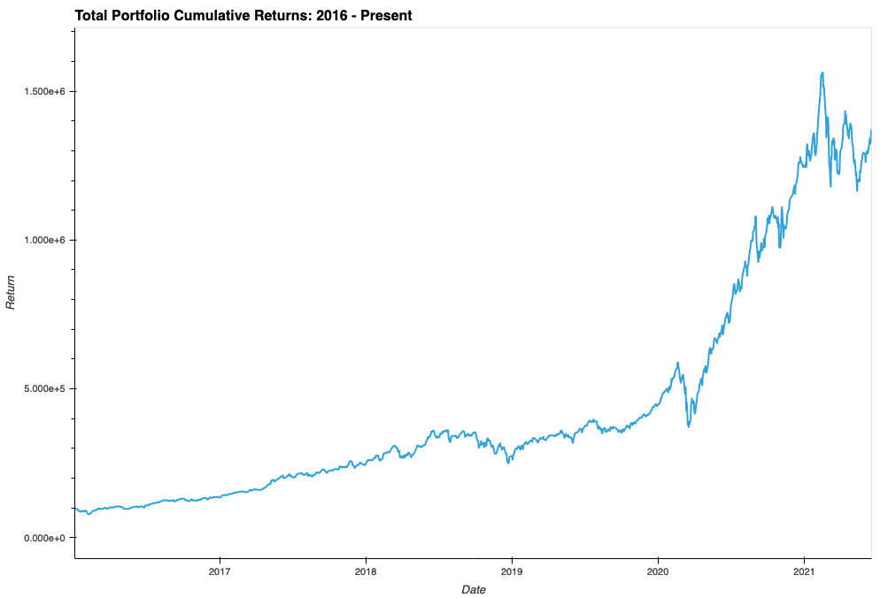
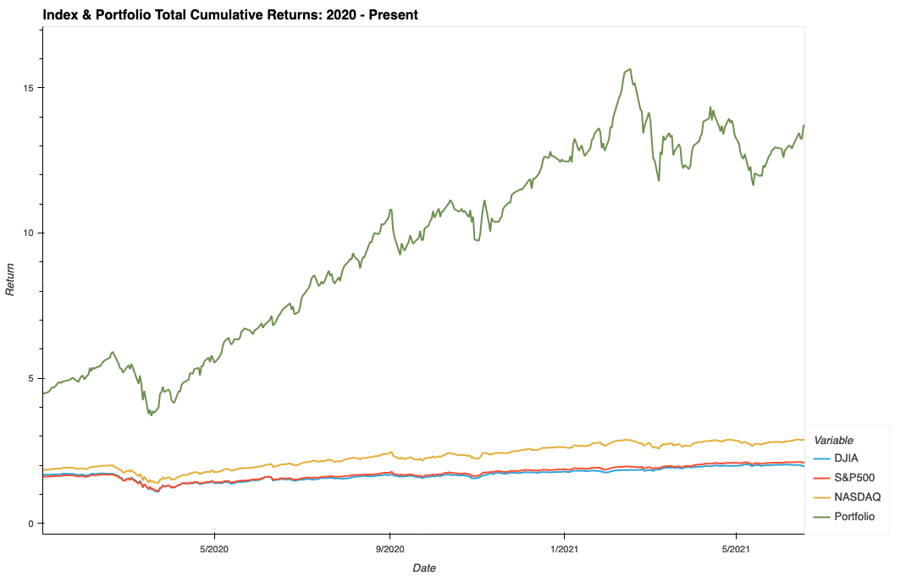
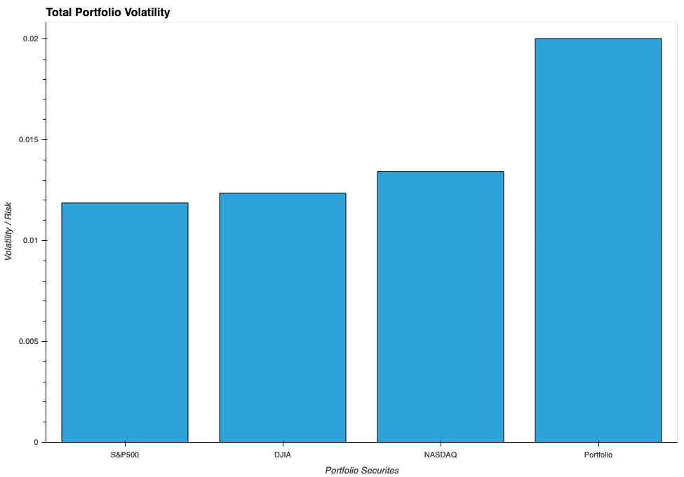
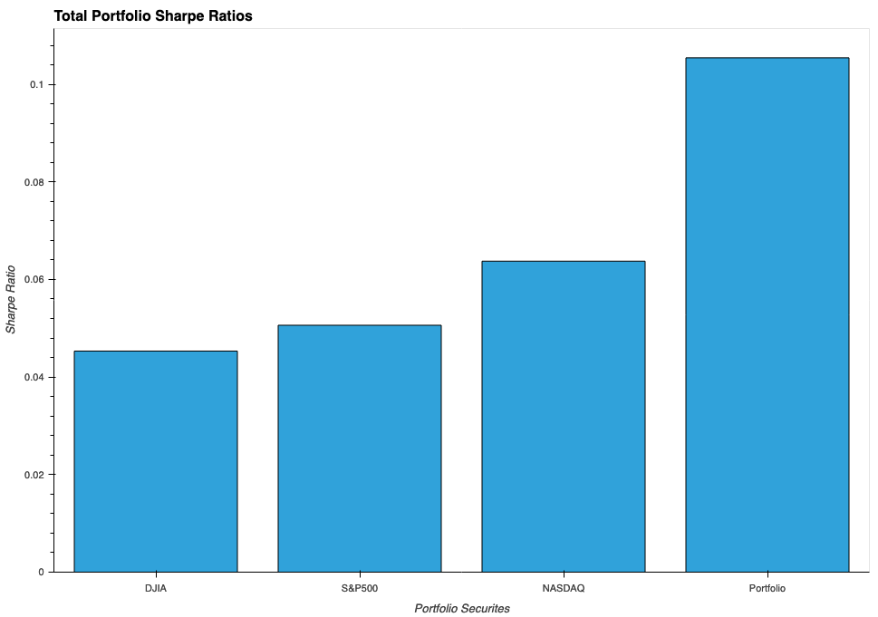

# Portfolio Analysis Project

## Project Overview

#### Goal
Create a portfolio with a long term buy-and-hold strategy focus that can be updated and analyzed daily. 
* ***Note that the analysis in the ReadMe.md is based on portfolio data ending June 18, 2021.***

#### Initiative
Create a portfolio consisting of 10 popular growth stocks (Apple, Facebook, Nvidia, PayPal, Shopify, Square, Teladoc, Tesla, Twitter, and Zillow)
* Compare and analyze the historical performance of the holdings in the portfolio with each other
* Compare and analyze the portfolio's historical performance with that of the three major indexes
* Compare the historical performance of the three major indexes with the 10-Year and 30-Year Treasury Yields

#### Portfolio Holdings
* Apple: $10,000
* Facebook: $10,000
* Nvidia: $10,000
* PayPal: $10,000
* Shopify: $10,000
* Square: $10,000
* Teladoc: $10,000
* Tesla: $10,000
* Twitter: $10,000
* Zillow: $10,000
* **Total: $100,000**

#### Coding Tasks
* Gather and clean five years' worth of market data (01/04/2016 - 06/18/2021)
* Analyze the portfolio holdings' quantitative performance
* Analyze the portfolio's quantitative performance in relation to the S&P 500, Nasdaq, Dow 30 and 10-Yr and 30-Yr Treasury Yields
* Determine the portfolio holdings' total cumulative performance
* Analyze the portfolio holdings' risk and volatility

## Stock Portfolio Holdings Evaluation

#### Stock Portfolio Return Chart

Based on the Portfolio Return Chart, our top three stock performers were Shopify, by a comfortable margin, Nvidia and Square. Our three worst performers were Twitter, Facebook and Zillow by a very thin margin. When mentioning a stock's "performance", we are referring to its cumulative return throughout the portfolio's five-year time period (01/04/2016 - 06/18/2021). Note that while cumulative return is a great measure of performance for our portfolio, context matters as well and certain caveats must be acknowledged. For instance, considering Apple to be one of the worst performing stocks in our portfolio, alongside Twitter, is a mistake when you take into account Apple's IPO took place in 1980 (leading to many millionaires being created) while Twitter's took place in 2013. With this in mind, we will attempt to analyze our portfolio's quantitative performance fairly, yet still subjectively.

When comparing the top and worst performers in the portfolio, Twitter performing as poorly as it has really stands out considering its high level of volatility (which we will see later). In the last five years, Twitter has returned a modest 269.73% - "modest" may sound a bit hyperbolic but considering its peer group, its poor performance is disappointing. To give a visual, the Nasdaq Composite Index saw a return of 286% in the same time period - you would've fared better putting your money in a Nasdaq-tracking ETF and going to work on your golf swing. Much of the lag can be attributed to its inability to capitalize financially on its popularity among politicians, celebrities and millenials, leading to shareholders calling for CEO Jack Dorsey to step down. Twitter has recently released some new features meant to combat this issue, including Spaces (think Clubhouse), so there is promise here. Shopify, on the other hand, is full of promise. Since its IPO in 2015, Shopify has not disappointed shareholders at all, leading it to be one of the best growth stocks and e-commerce platforms in the market. To-date, Shopify has seen cumulative returns of over 5600% while its stock price has soared from $25.72 all the way to $1,466.87. 

Following our top performers, Nvidia and Square have both had very impressive performance runs up until now with each returning over 2300% and 1900%. Nvidia's eye-popping returns can be contributed to its great management, its ability to innovate, **the rise of semiconductors**, its huge (presently-potential) acquisition of Arm and, of course, its recently announced stock split (since this announcement it's market price has risen over 145 points). Square has also boasted great management (the irony is not lost on me), the ability to reinvent itself and a rise in popularity due to technological innovation. Between our top three performers, its difficult to predict which will be the most impactful within the next five to ten years due to all three of their industries being predicted to see exponential growth. It's not, however, difficult to predict when you add in the fourth highest performer - of course unless you're a bitcoin enthusiast, an oil lobbyist or over 40 years old. Tesla has seen a meteoric rise in both popularity and share price since 2020 began, and as a result of this - the mainstream cult-like obsession of its captivating Founder/CEO/SNL Star helps as well - the electric automobile industry has gained massive popularity and legitimacy.

---

#### Stock Portfolio Adjusted Closing Prices

The Adjusted Closing Prices graph above provides a clear visual of our Adjusted Closing Prices graph. The contrast between Shopify and Twitter is all but jaw-dropping, considering that both are extremely popular with millenials and even moreso with Gen Z. Although they may not be clearly visible on the graph, PayPal and Teladoc are two very intriguing (and promising) companies in our portfolio that have performed well. Similar to Square, PayPal is a payments processing company that is expanding its breadth of services and choosing innovation, most notably with its fairly recent addition of bitcoin to its balance sheet. Although not as flashy or captivating as Square, PayPal is well positioned to continue to make strides in this next decade after doing so this last half-decade - PayPal has seen a 815% cumulative return since 2016 until now, without offering much volatility or risk on top of that. 

Teladoc was another great performer in our portfolio, seeing cumulative returns of over 768% in our time-period and doing so in anxiety-inducing fashion. Most of Teladoc's rise can be attributed to its industry-leading position in the telehealth space at the beginning of the coronavirus pandemic - its stock price was just over $95 at the beginning of 2020. Although the stock has seen a large pullback in 2021, Teladoc is expected to be a major player in the market this next-decade due to the expected rise in popularity for telehealth and its major 2020 acquisition of Livongo, a former industry leader itself.

---

#### Annualized Stock Portfolio Volatility

The chart above illustrates each portfolio holding's level of annualized volatility, or simply put its level of risk. The more risky a stock is, the higher you expect its returns - its the same concept of putting up with a toxic work environment because the position pays a high salary and offers great benefits (although this way of living is not recommended). The reason people invest in a company as risky as Tesla is because of the massive returns it can potentially see, just as people invest in Apple and Facebook because they are safe, reliable, and don't often suffer 5%-plus drops in share price in a single day.

Unsurprising to anyone with access to the internet (and some basic market knowledge), Tesla is our most volatile stock and Apple is our most stable and least risky stock. What is a bit surprising, however, is not Teladoc and Square being close second and third's, but Zillow and Twitter being close fourth and fifths. For Twitter's returns to be so substandard, yet for the stock to be so risky, is a clear indictment on what the market thinks of Twitter as a business. Zillow's stock performance isn't as bad as Twitter's, boasting a 524% cumulative return, but it isn't near the performance range of the top three riskiest holdings in our portfolio. Although a great company and a leading disruptor in the real estate industry, its market share was as low as $27 just over a year ago (March 2020) after IPO'ing at $20 per share. There is, however, hope for Zillow's future as an industry leader in the real estate sector. The real estate market is booming in 2021 and this trend is expoected to continue in the near-to-mid term. In addition, Zillow is a player in the iBuying space, along with companies like OpenDoor and Redfin, and this sector is expected tosee tremendous growth.

---

#### Annualized Stock Portfolio Sharpe Ratios

The Annualized Stock Portfolio Sharpe Ratios chart listed above is one of the clearest indicators of stock performance for our portfolio. Sharpe ratio measures a stock's performance while taking into account it's level of risk - for instance, although Tesla had a higher cumulative return than Apple (almost three times as much), Apple has a higher Sharpe Ratio because it offers a very small amount of risk whereas Tesla is **very** risky so its returns seem less attractive. With this in mind, it seems obvious that Shopify would have the highest Sharpe ratio of all - it managed to have the greatest cumulative returns by far without incurring much volatility. Two things worth noting in the chart are 1) PayPal and Square having nearly identical Sharpe ratios and 2) the Nasdaq Index having the seventh highest Sharpe ratio. Since Square and PayPal are competitors in the market and both offer the same reward-to-variability ratio, choosing which to invest in between the two depends solely on an investor's risk tolerance. If an investor is risk averse, they are better served investing in PayPal; however, if an investor doesn't mind risk and is after large returns in the market, then Square would be the best choice for them.

Investor-favorite Twitter came in last place on our Annualized Stock Portfolio Sharpe Ratios chart - behind the Dow Jones index, S&P 500 index and Nasdaq. Essentially, this can be interpreted as you as an investor would be better served investing in an index-tracking ETF than investing in Twitter because the gains aren't worth the risk.

---

#### Top Performer

Based on the results of the quantitative and risk analysis, Shopify has been the best performing stock in the portfolio over the last five years and looks like it will continue this trend for the immediate future. Since 2016, Shopify has had a cumulative return of over 5,700% meaning our initial investment of $10,000 would have grown to just over $195,000. More importantly, though, it is only offers relatively moderate risk when compared to the rest of the portfolio's holdings. When observing the portffolio's Annualized Stock Volatility, Shopify ranks sixth out of 10 meaning that five other stocks in the portfolio offer more risk and volatility while simultaneously providing less of a return. This is also clearly illustrated when looking at the portfolio's Annualized Sharpe Ratios.

---

## Stock Portfolio-Index Evaluation

The total portfolio, with evenly-allocated capital among the holdings, performed very well throughout the five-year time period despite the market crash in early 2020 and the market laggards. Overall, the portfolio achieved cumulative returns of 1,372.57% and our $100,000 investment grew to a total of $1,372,572. W

hen compared to the major indexes, our portfolio heavily outperformed each by a wide margin. Being that the Nasdaq most heavily reflects our portfolio's focus, it was the most comparable index - although not by a particularly wide margin.

We are pleased with our returns, however, in a real-world scenario the portfolio would've reflected a much more sensible allocation. Holdings like Twitter or Facebook would not have been allowed the same amount of capital allocated as holdings like Shopify, Square or Nvidia - or even Tesla for that matter. 

Considering that we employ a long-term focus with our portfolio and we primarily invest in the growth stocks, 

---

